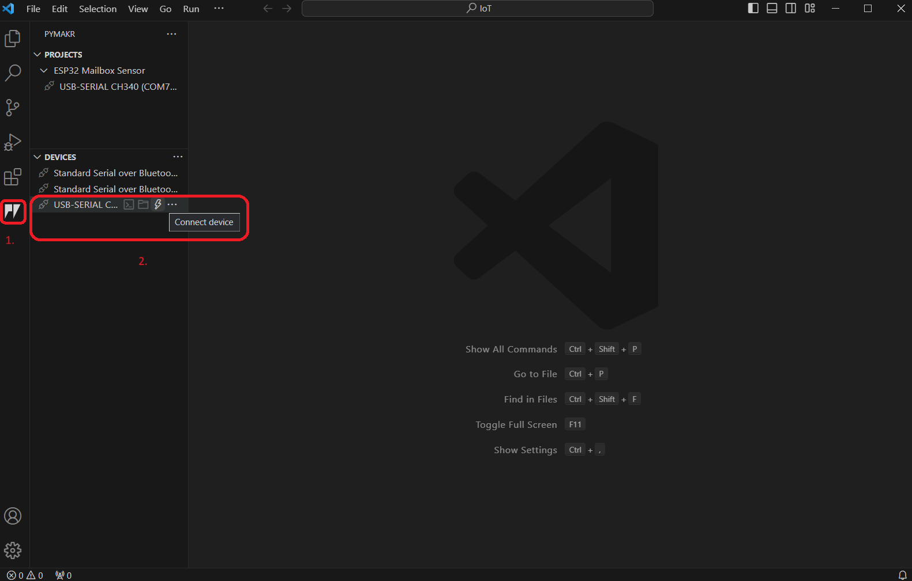
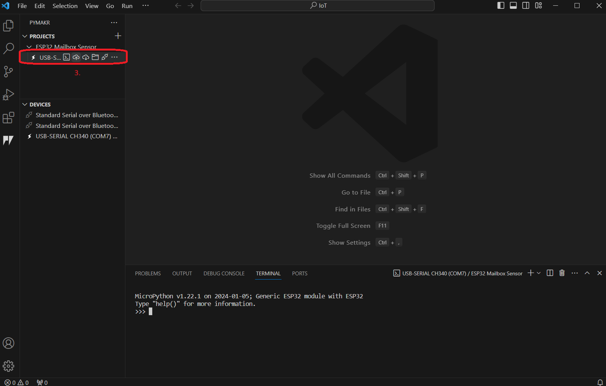
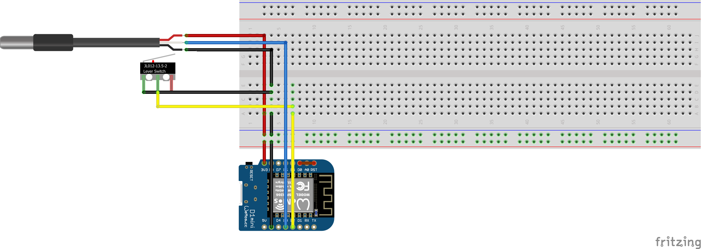
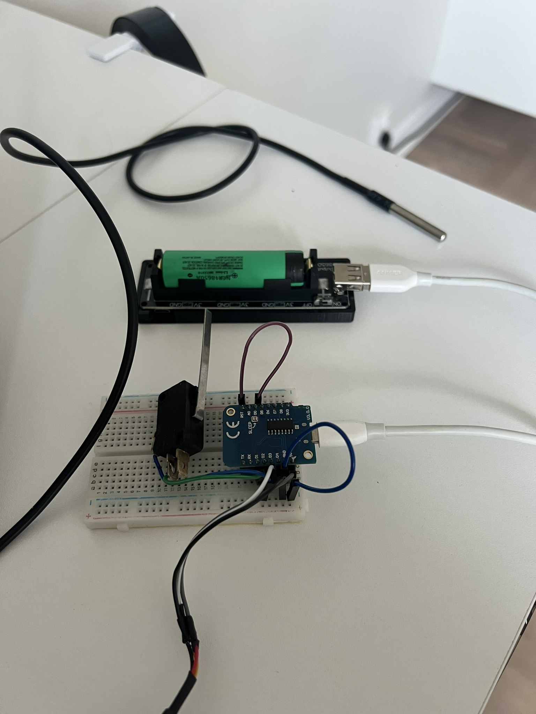
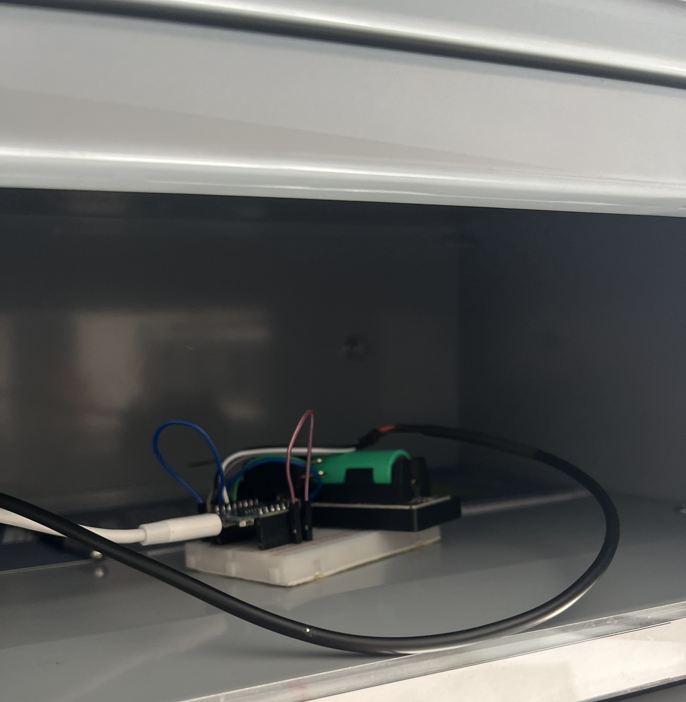
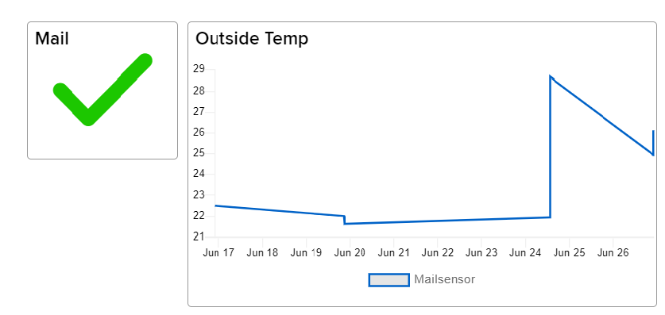
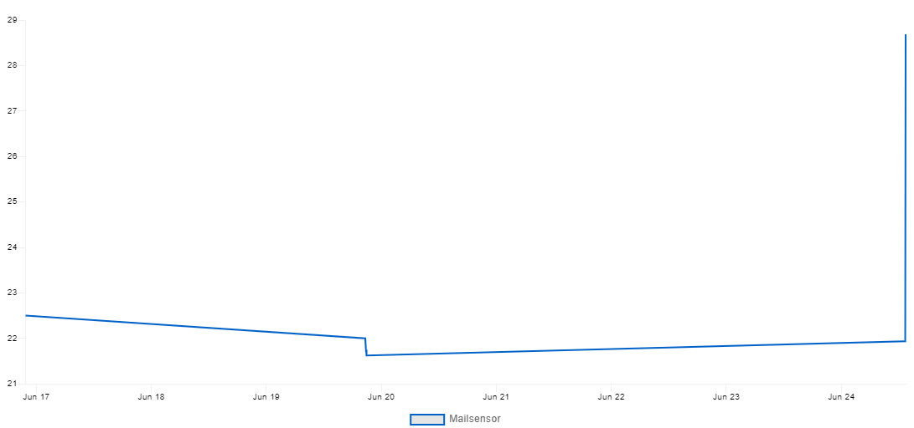
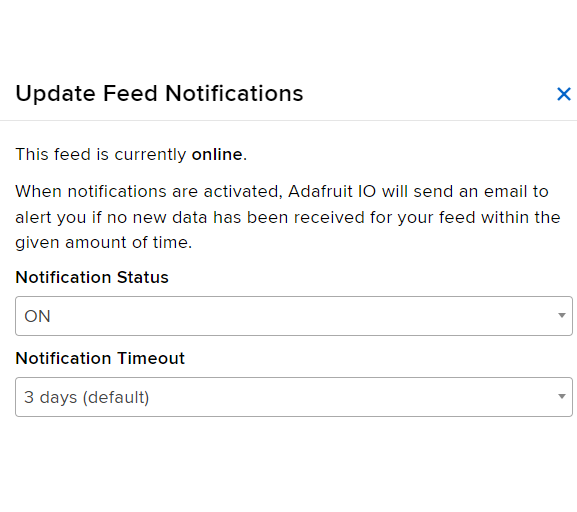

# Mailboxsensor
Philip Persson | pp222pr

The device resulting from this project should be installed 
in a mailbox, and has the following capabilities: 
* Measures if there's a package based on the pressure of a limit switch 
sensor. 
* Measures the outside temperature


Estimated time needed for this project: **3 hours**
<br>

# Objective 

With a mailbox sensor, it becomes unnecessary to go to the mailbox to check for mail when there is none. The idea arose after Postnord introduced two-day delivery, making it even more time-consuming and unnecessary to check the mailbox daily.

Hopefully, this project will provide those replicating it with:

- A general understanding of how IoT devices operate
- Some knowledge about electronic circuits
- Some knowledge about programming in (micro)Python
- How the adafruit api and webinterface works

<br><br>


# Material
| Component                                                                                                                                                                  | Purpose                                                                                                                                  | Where to buy   | cost         |
|----------------------------------------------------------------------------------------------------------------------------------------------------------------------------|------------------------------------------------------------------------------------------------------------------------------------------|----------------|--------------|
| ESP8266                                                                                                   | This is the microcontroller, which is taking care of connecting to the internet and managing the  electronic part of this project. | [Amazon.se](https://www.amazon.se/AZDelivery-D1-Mini-ESP8266-12F-WLAN-modul/dp/B01N9RXGHY/ref=sr_1_4?dib=eyJ2IjoiMSJ9.REw2xtG03XXipAz6jDczWnijAd8z8j789TyMc3HcGh6Q3M1g4XRuTm_dTemlRkTxPyk-ScKOUw4TYZTG5lJ5joE_Hvf5T0BjsDX5S7h3usw074BduOEv0eN8eEySwgYATnz1rLFl01tQYM8TNLePtRUoQoYi1pO4WSUGjaKIAMLgIdvBeAOaVv66FSpN4StL-OLOtP9jIzP91ai7mchHqIjllTlM_n1YhWkRf7J5yDGNQ1do6Pqwcq1exZMI3_2p4-1_rGEQgH2XCdIR6OjiFwDHsZ3_r6yueg1GVIFsjmQ.5JSBIdBR-PQjPZbMfVCWEvqBZTcdA6-zg5ZBpSVHYu0&dib_tag=se&keywords=wemos%2Bd1%2Bmini&sr=8-4&th=1) | 80 kr |
| Dupont wires                                            | The dupont wires server the purpose of connecting the microcontroller to electronic equipemnt easier                                     | [Amazon.se](https://www.amazon.se/Elegoo-Flerf%C3%A4rgad-Breadboard-Bandkablar-Arduino/dp/B01EV70C78/ref=sr_1_37?crid=5QI12MGP7MDN&dib=eyJ2IjoiMSJ9.omk2kKEUe-hO8sYbhtAvp4AL7vIZJAAqnNkdtziy2JyK8JUUwOGscKz92GzT2uQAX3uXpaXlxWPI61HJvWf49JL5CEy5zDx9LEcvTzVlyi5sNEqz8yYEQXUE6FqVTg-AQdxTx9b5z4-MP9WBLZlxR4bEIzM_WxCuGJ7nYzX3RuNySdazNg1yfN3CBpEUecSCX_d_FQ7ObsSFxGzDZVP8gNRZoMeNeA_XZz71WqzZhoL0v0UPyeq74vquHgueNhhgVJ0MZX5R-OnWX2M8F_QMFukjDTx1QlYzL4z8P--QzgI.wtvZ9zNxYKWaWLvPhr8MArCmczPHUCVRiOqBP3t2tfs&dib_tag=se&keywords=Dupont&sprefix=dupo%2Caps%2C2066&sr=8-37&th=1) | 75 kr|
| Limit switch                                                                            | The limit switch is the main component sensing if there's mail or not.                                          | [Amazon.se](https://www.amazon.se/Gebildet-miniatyr-mikrogr%C3%A4nsbrytare-tillf%C3%A4llig-tryckknapp/dp/B07T9DWMMG/ref=sr_1_28?crid=22C70TS60UO53&dib=eyJ2IjoiMSJ9.xFhvtVR9le7u8Lua0IBk-SXKYKKbtP55FcG77FOYzJZXG-PvH-6DL61n9AQSA4fKlNSDBgFu7WHT9LX5-mWXthD0O-dZbvtmnuJ_O4MPtj_FbNVjgyYLSd9Q8i_GRJgGwmkkPb32ph-4zOouuxU-wWlWcp_mL_OrfJqsgCPTX3EjwFsU-lf_2pCBHIzqYWKyv2lT0gmIbHI3n1Rm2YpHA__koL6Pgqfhmt0s-6cDBPVWzesCpLSkFGDWMqo_oyUEHRq-KuOsuCBB6D5KLUV5BDVREEVMJc-RK0BOtKJhnuc.p2sgw5OGUtdaiYMDQCWwMDyMdc8PXN-3m7oljvIS0Sc&dib_tag=se&keywords=Limit%2Bswitch&sprefix=limit%2Bsw%2Caps%2C448&sr=8-28&th=1) | 105 kr |
| Temperature sensor                                                                             | Waterproof temperature sensor to sense the outside temperature                                          | [Amazon.se](https://www.amazon.se/MASUNN-Ds18B20-vattent%C3%A4t-digital-temperatur/dp/B074X1FSWZ/ref=sr_1_52?dib=eyJ2IjoiMSJ9.ejNeMJuLVphW9F8HwVpCSWdlEi0ys0C5UewyYSIjyRci42j9M14oIdxh6Hm4XGnLK8JUpmBuJLyyglSKdOHExehdvhPm44pGt_ZbaJ5Z8QJ1VQfkxffVPpV5LLs9Ebr7X2noIXon7MmHByAmyFoiYMLwI2q5_4mjm5uO7b1ojXHvKubNVw46Wujn55CbTxvl5a0nfIBUF3Y-mES6E2jRFW1MPkEJSuNBH98VgFCdoVTsi88tG7xVfuauFD0hDdV0MDMK_Siz-VMs5KkMH9wEfDs1ft5fSUihKcG_n7_SVK8.yFaye6SJdTnibGa5acLXhu_Kazyhn_kj5NKnjpkoCjM&dib_tag=se&keywords=arduino%2Btemp%2Bsensor&sr=8-52&th=1https://www.amazon.se/Gebildet-miniatyr-mikrogr%C3%A4nsbrytare-tillf%C3%A4llig-tryckknapp/dp/B07T9DWMMG/ref=sr_1_28?crid=22C70TS60UO53&dib=eyJ2IjoiMSJ9.xFhvtVR9le7u8Lua0IBk-SXKYKKbtP55FcG77FOYzJZXG-PvH-6DL61n9AQSA4fKlNSDBgFu7WHT9LX5-mWXthD0O-dZbvtmnuJ_O4MPtj_FbNVjgyYLSd9Q8i_GRJgGwmkkPb32ph-4zOouuxU-wWlWcp_mL_OrfJqsgCPTX3EjwFsU-lf_2pCBHIzqYWKyv2lT0gmIbHI3n1Rm2YpHA__koL6Pgqfhmt0s-6cDBPVWzesCpLSkFGDWMqo_oyUEHRq-KuOsuCBB6D5KLUV5BDVREEVMJc-RK0BOtKJhnuc.p2sgw5OGUtdaiYMDQCWwMDyMdc8PXN-3m7oljvIS0Sc&dib_tag=se&keywords=Limit%2Bswitch&sprefix=limit%2Bsw%2Caps%2C448&sr=8-28&th=1) | 105 kr |
| 18650 holder shield                                                                                  | A holder for the 18650 battery. Handles charging and power delivery to the project.                                                                    | [Amazon.se](https://www.amazon.se/Heemol-Micro-Wemos-18650-batterisk%C3%B6ld/dp/B0B6GCGYDC/ref=sr_1_17?crid=39I49NOLSOLP3&dib=eyJ2IjoiMSJ9.bhVuQzPMa4Yie6tuiW5N6WX730RUg9nkrqAe2E1in9tCGesaZdf-pLmCOkH2igmvZ-L1aOhxOqC1cAmJ9iwQ21ilf-2onTGzV-7NMN2ytVtdrMYykcX-RV8LH9ERPPSmZ2J36uoVX0SFP_fRPSf6PwWoxgvQcLMwF4Ioz6Jv9GKlQpQsh2PEj0AWiI2gc7H6H1Ax4LjrkHNcEGsqIe2_6AHbGuq6uzyXNspH__BXleRnlYGsssnxoxWeno7YJSEwnokC6J9BCNupHXifJZU7iOsCmZPJQs9IrCpcHi9jopc.Tqc394An-6aWWs3OwtfEK4YPZVAiPC1Q5xHNkoSjUVI&dib_tag=se&keywords=18650+shield&sprefix=18%2Caps%2C2686&sr=8-17)       | 100 kr        |
| 18650 Battery                                                                            | A beefy battery to keep the sensor work without need of power.                                         | [Kjell & Company](https://www.kjell.com/se/produkter/el-verktyg/batterier/litiumbatterier/kjell-company-18650-li-ion-batteri-36-v-2600-mah-p32058)     | 150 kr        |
Total cost | || 550 SEK


*Please not that I already had some of the components at home, therefore some of the items in this project does not correspond with pictures in this table.* 


# Setup
The IDE I am using is [Visual Studio Code](https://code.visualstudio.com/), with the plugin [pymakr](https://marketplace.visualstudio.com/items?itemName=pycom.Pymakr) The pymakr makes it easier to flash and run the code on the ESP8266.
<br>

### Flashing Micropython on ESP8266
To flash MicroPython firmware on ESP8266:

1. Download the latest version of MicroPython firmware for the ESP("&&) from the [MicroPython Downloads page](https://micropython.org/download/ESP8266_GENERIC/). At the time of writing this response, the latest release is **v1.22**.
<br>
2. Ensure that you have Python 3.7 or newer installed on your system. 
    - To check if Python is installed on your system, you can follow these steps:
    - Open a terminal window.         
        ``` python
        python --version
        ``` 
        If Python is installed, the version number will be displayed. If not, you will receive an error message.:x:

    - If not, go to [Python’s](https://www.python.org/downloads/) website and install it on your computer.
<br>
3. Install esptool
Open a Terminal window and install esptool.py with pip by running the following command: 
    ```python
    pip install esptool
    ```
    If you receive an error:x: try installing esptool.py with 
    ```python
    pip3 install esptool
    ```
    :heavy_exclamation_mark: :heavy_exclamation_mark::heavy_exclamation_mark:
    If u have installed from Windows store, u should run 
    ```python
    python -m pip install esptool
    ```

After installing, you will have esptool.py installed onto your system and you should be able to run it with the command esptool.py.

3. Connect your ESP8266 to your computer via USB.

4. Open a Terminal window and erase the flash memory of your (ESP8266) with the following command: 
    ```python
    python -m esptool --chip esp8266 --port <serial_port> erase_flash.
    ```
<i>Replace <b><i><serial_port></b></i>  with the name of the serial port of your ESP8266.</i>

- To find your <b><i><serial_port></b></i> of your ESP8266 on Windows using the Device Manager:
<br>
    1. Connect your ESP8266 to your computer via USB.

    2. Open the Device Manager by pressing the Windows key + X and selecting “Device Manager” from the menu.

    3. In the Device Manager, look for the “Ports (COM & LPT)” section and expand it by clicking on the arrow next to it.

    4. Your ESP8266 should be listed under “Ports (COM & LPT)” with a name that includes “USB Serial Port” or “USB Serial Device”. The name of the port may vary depending on the manufacturer of your ESP8266.

    5. Take note of the name of the port, which should be in the format “COMx” where “x” is a number. This is the name of the serial port of your ESP8266.


5. After erasing the flash memory, flash the MicroPython firmware with the following command: 
    ```python
    python esptool --chip ESP8266 --port <serial_port> write_flash -z 0x1000 <firmware_file>.bin. 
    ```

## Uploading code to ESP8266

1. Open the pymakr plugin in visual studio code. It should appear on the left side when it's installed. 

2. 


If these instructions are not clear enough. This [guide](https://www.youtube.com/watch?v=39Om3EImXaM) shows an example of code is uploaded to an microcontroller using pymark.


# Putting everything together


**Limit switch**
<br>
COM -> GND
<br>
NO  -> D1

**Temperature sensor**
<br>
VCC -> 3.3V
<br>
GND -> GND
<br>
COM -> D3


This is only a tempory development setup. A good way for further development could be to design and print a case for evrything. One step furthermore would be to design a custom PCB to make it more ready for production.

The wiring is fairly simple and can be seen in figure one. Both the temperature and the limit switch are connected to a ground- and 3 volts rail at the bottom of the breadboard, which is connected to the ESP8266. 
<br><br>




Picture of the *""finished""* product. Idealy the mailbox would be positioned outside, but since I currently live in an apartment tahts sadly not possible. The mailbox itself is a metal one, however since I live currently close to the mailbox the connecticty was never a problem for me. This could be a problem if tha mailbox was positioned furhter away, then an external WiFi antenna could be an solution. 


# Battery life
I used the following way to calculate the daily energy consumption: [^1]

## Battery Life Calculation

### 1. Calculate Active Period Consumption
- **Active current**: 77.88mA
- **Active duration**: 10 seconds (10/3600 hours)
- **Active consumption per cycle**:

    <p>$$
     77.88 \times \frac{10}{3600} \approx 0.217 \text{ mAh}
    $$</p>
    
### 2. Calculate Sleep Period Consumption
- **Sleep current**: 0.084mA (or 84µA)
- **Sleep duration**: 30 minutes (0.5 hours)
- **Sleep consumption per cycle**:
  
<p>$$
     0.084 * 0.5 = 0.042 \text{ mAh}
$$</p>


### 3. Total Consumption Per Cycle
- **Total consumption per cycle**:
  
<p>$$
  0.217 \text{ mAh} + 0.042 \text{ mAh} = 0.259 \text{ mAh}
$$</p>


### 4. Calculate Number of Cycles
- **Battery capacity**: 2600mAh
- **Number of cycles the battery can support**:
  
<p>$$
  {2600 \text{ mAh}}{0.259 \text{ mAh/cycle}} \approx 10038 \text{ cycles}
$$</p>

### 5. Calculate Total Time in Hours
- **Each cycle duration**: 30 minutes + 10 seconds (30.167 minutes or 0.5028 hours)
- **Total time**:
<p>$$
  10038 \text{ cycles} \times 0.5028 \text{ hours/cycle} \approx 5047.9 \text{ hours}
$$</p>

### 6. Convert Total Time to Days
- **Total time in days**:
<p>$$
  \frac{5047.9 \text{ hours}}{24 \text{ hours/day}} \approx 210 \text{ days}
$$</p>

### **Summary**
With an active period of 10 seconds and a sleep current of 84µA (0.084mA), the device can run for approximately **210 days** on a 2600mAh battery.


I am assuming thath the ESP8266 sleeps for 30 minutes (it should only wake up evry 30 min and report the temperature and if there's package in the mailbox.)

<i>*this is just an estimation of the powerdraw and could wary up and down</i> 


[^1]: [wemos-d1-mini-deep-sleep-current-draw](https://example.com](https://salvatorelab.com/2023/01/wemos-d1-mini-deep-sleep-current-draw/).

# Platform
Since the ESP8266 is a small and easy microcontroller with wifi capabillitys, I thought this was the most ideally microcontroller for this project. A Rasperry pico W was also a candidate, however, these tense to cost more than a ESP8266. The main reason the ESP8266 was choosen fot his project was becuse usally the ESP8266 is ideal for projects where cost and WiFi connectivity are primary concerns, while the Raspberry Pi Pico W offers more processing power, memory. In this case the memory and processing power of a Pi Pico W was not necessary. 


Concerning the websites and platforms, I am using adafruit io and MQTT. Adafruit is a website, which provides so called "feeds" which accept data from for example a microcontroller. I am using two different feeds, one for the temperature and one to monitor if the pir sensor has detected motion. This data is the visualised by a different tool within adafruit: the dashboard: <br><br>


# The code
Since its not good code practice too hard code any values, since this is different from user to user. I have choosen to use a config files where all the secrets are put in. 
```
WIFI_SSID = "XXX"
WIFI_PASSWORD = "XXX"
WIFI_STATIC_IP = "192.168.XX.XX"
WIFI_SUBNET = "255.255.255.0"
WIFI_GATEWAY_IP ="192.168.XX.X"
WIFI_DNS ="1.1.1.1"
STATIC_IP = True


AIO_BROKER                  = 'io.adafruit.com'
AIO_PORT                    = 1883
AIO_USERNAME                = 'USERNAME'                                    
AIO_ACCESS_KEY              = (Something like: aio_lotsofnumbersandletters)
AIO_TOPIC                   = ""
```


The main loop of the ESP8266 looks something like this (--some code is cut out on purpose--)
```
while True:
    ds_sensor.convert_temp()
    time.sleep_ms(750)
    # Loop through all the DS sensors. This is done becuse you could eventaully add more DS sensors.
    for rom in roms:
        client.connect()
        publish_message(client, ds_sensor.read_temp(rom))
        client.disconnect()

    # Check if the button is pressed and publish message
    if not button.value():
        message = "Mail!"
        client.connect()
        publish_message(client, message)
        client.disconnect()
    # Put the device into deep sleep mode for 1800000 milliseconds (30 minutes)
    deep_sleep(1800000)
```

The provided code in this repo is not fully complete. This is made by choice, this repo *should* be seen more than a guide, then a complete product. 


# Connectivity
To send data it uses the built in WIFI of the ESP8266 and the MQTT protocol to send data from the ESP8266 microcontroller to the adafruit website. However, adafruit is not the only alternativ the user of this project has. Some other valid alteratives could be Mosquitto, AWS IoT, HiveMQ. 
MQTT is used to send the data thanks to it's lightweight and efficient, minimizing data overhead and reducing power consumption

### How often is the data sent?
Sending data every 30 minutes is a strategic choice to balance battery life and data relevance. Less frequent transmissions conserve battery power, which is crucial for battery-operated devices. For temperature readings, a 30-minute interval is often sufficient to capture meaningful changes.

# Presenting the data
  Data is displayed in the Adafruit dashboard interface. Giving it a nice and clean look. The temperature is displayed on the graph to the right and is saved for 30 days in the Adafruit cloud. 30 days is choosen becuse I dont think I need any longer history of weather or mail. When there's mail in the mailbox, the green checkbox will be checked, giving it a clear view there's new mail.
 
 


## Automation/triggers of the data.


When there's an update to the limit switch (Meaning there's mail in the mailbox), Adafruit will send a email to my registered email to notify me there's mail. 
# Final thoughts
The project began with a goal: to use an ESP8266 microcontroller to monitor the outside temperature and receive notifications when mail arrives. This aligns with the broader aim of leveraging smart technology to simplify everyday tasks, which is seen as a valuable use of modern advancements.

One challenge was that I intended to do was design of a 3D case. Due to a lack of expertise in 3D modeling and insufficient time to develop this skill, a custom case could not be created. 

Additionally, there were thoughts on further improving the project by incorporating additional sensors. For instance, adding a DHT11 sensor would allow for humidity measurement, providing more comprehensive environmental data. Another potential enhancement was the inclusion of a lux sensor to measure sunlight, which could offer valuable insights for various applications.
